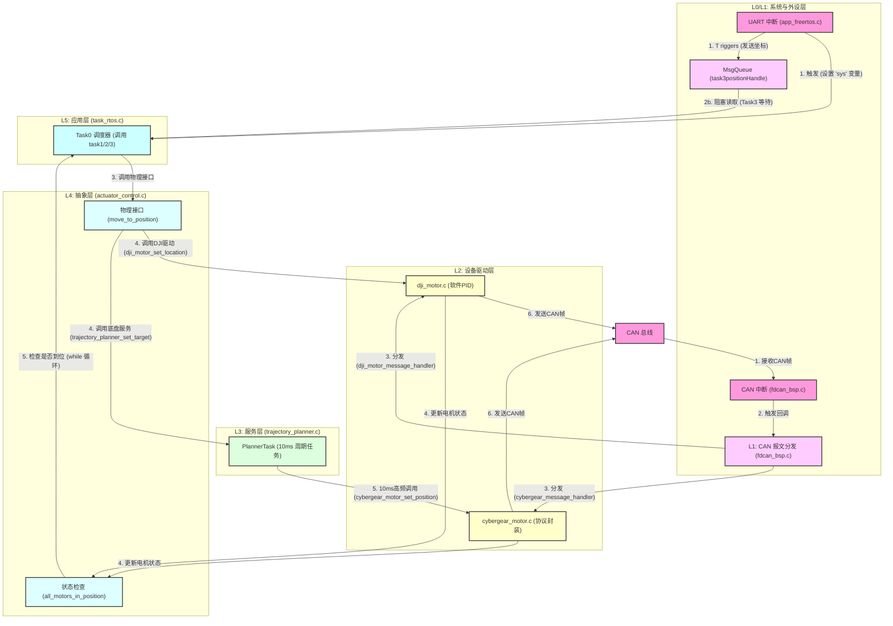

# 工程架构分析

本文档分析了该嵌入式项目的软件架构，该架构基于 FreeRTOS，采用清晰的分层设计，实现了任务逻辑、运动抽象、设备驱动和硬件外设的解耦。

---

## 🌳 1. 架构分层概览 (自顶向下)

整个工程可以被清晰地划分为五个主要层次：

* **L5: 应用层 (Application Layer)**
    * **文件:** `task_rtos.c`
    * **职责:** 机器人最高级的任务逻辑和状态机（例如执行任务一、二、三）。

* **L4: 抽象层 (Abstraction Layer)**
    * **文件:** `actuator_control.c` 
    * **职责:** "翻译官"。将机器人的“物理动作”（如 `height = 100.0f mm`）翻译为“电机动作”（如 `location = 80000 ticks`）。

* **L3: 服务层 (Service Layer)**
    * **文件:** `trajectory_planner.c`
    * **职责:** 提供独立的后台服务。例如，为底盘提供平滑的梯形速度轨迹规划，优化运动体验。

* **L2: 设备驱动层 (Device Driver Layer)**
    * **文件:** `dji_motor.c`, `cybergear_motor.c`
    * **职责:** 封装特定硬件（DJI电机, 小米电机）的通信协议和控制逻辑。

* **L1: 外设驱动层 (Peripheral Driver Layer)**
    * **文件:** `fdcan_bsp.c`
    * **职责:** 提供通用的总线通信能力（如 FDCAN），解耦硬件中断和上层设备。

* **L0: 系统层 (System Layer)**
    * **文件:** `app_freertos.c`
    * **职责:** 操作系统内核的初始化、任务/信号量/队列的创建，以及硬件中断的入口点。

---

## 📥 2. 系统入口点 (数据来源)

系统由两个主要的外部事件驱动：

1.  **串口指令 (`app_freertos.c`)**
    * **函数:** `HAL_UARTEx_RxEventCallback`
    * **流程:** 串口接收到指令（如 'a', 'b', 'c' 或 'F...'）。
        * 对于任务1/2，它设置**全局变量 `sys`**。
        * 对于任务3，它解析坐标并通过 `send_task3_positions` 将数据放入 **FreeRTOS 消息队列 `task3positionHandle`**。

2.  **CAN 总线反馈 (`fdcan_bsp.c`)**
    * **函数:** `HAL_FDCAN_RxFifo0Callback` / `RxFifo1Callback`
    * **流程:** CAN 硬件收到数据帧，触发中断。这是所有电机反馈数据的唯一入口点，它会触发 L1 的分发逻辑。

---

## ⚙️ 3. 各层次详细分析

### L0/L1: 系统层 & 外设驱动层

* **`app_freertos.c` (系统层):**
    * **职责:** FreeRTOS 的“启动区”和“中断服务区”。
    * **实现:**
        * 创建所有 FreeRTOS 实例：`Task0` (主调度任务)、`prv_planner_task` (轨迹规划任务)、`task3positionHandle` (消息队列)、以及各种互斥锁。
        * 处理串口空闲中断 (`HAL_UARTEx_RxEventCallback`)，作为任务调度的主要信源。

* **`fdcan_bsp.c` (外设驱动层):**
    * **职责:** **CAN 报文发布-订阅 (Pub/Sub) 调度器**。
    * **实现:**
        * 被 CAN 中断（入口点2）触发。
        * 它**不关心**数据内容，只负责**路由**。它调用 `fdcan_dispatch_router`。
        * 此路由函数通过哈希表（标准帧, O(1)）或线性查找（扩展帧, O(n)） 找到“订阅”了该 CAN ID 的模块。
        * 调用 L2 设备驱动层注册的回调函数（例如 `dji_motor_message_handler`）。

### L2: 设备驱动层

L2 的两个驱动都“订阅”了 L1 的 `fdcan_bsp` 服务，但实现了截然不同的控制策略：

* **`dji_motor.c` (重型-软件PID):**
    * **订阅:** 向 `fdcan_bsp` 注册精确的标准 CAN ID (如 `0x201`, `0x202` ...)。
    * **核心:** 其 `dji_motor_message_handler` 是一个**实时控制循环**。
    * **流程:** 收到反馈 -> 解析数据 -> **立即运行串级PID** (`Pid_incremental_cal`) -> **立即发送新指令** (`dji_motor_send_commands`)。
    * **RTOS:** 使用**临界区 (`taskENTER_CRITICAL`)** 保护，防止 `set_location` 任务与 CAN 中断并发访问目标值。

* **`cybergear_motor.c` (轻型-协议封装):**
    * **订阅:** 向 `fdcan_bsp` 注册带掩码的扩展 CAN ID。
    * **核心:** 其 `cybergear_message_handler` 只是一个**协议解析器**。
    * **流程:** 收到反馈 -> `switch(comm_type)` 解析数据 (如 `case 2`, `case 17`) -> **更新 `measure` 结构体**。**不执行** PID 计算。
    * **RTOS:** 使用**互斥锁 (Mutex)** 保护 `cybergear_can_send_raw`，防止**多任务**并发调用 CAN 发送硬件。

### L3/L4: 服务层 & 抽象层

* `actuator_control.c`
    * **职责:** `task_rtos.c` 的唯一 API，提供“物理单位”接口。
    * **实现:**
        * 提供 `zhuzhou_control(float height)`。
        * 负责**翻译**：`height` (mm) -> `encoder_ticks` (int32_t)。
        * 调用 L2 的 `dji_motor_set_location()` 或 L3 的 `trajectory_planner_set_target()`。
        * **隐藏**了实现主轴的是 DJI 电机还是小米电机的细节。

* **`trajectory_planner.c` (L3 - 服务层):**
    * **职责:** 作为一个独立的 FreeRTOS 任务 (`prv_planner_task`)，实现轨迹平滑。
    * **实现:**
        1.  L4 (`Moter.c`) 调用 `trajectory_planner_set_target(rad)`，这只是**更新了最终目标**。
        2.  `prv_planner_task` 作为一个高优先级任务，**每 10ms** 运行一次。
        3.  它计算一个平滑的“中间位置” (`g_current_ramped_pos`)。
        4.  它**直接调用 L2** 的 `cybergear_motor_set_position()`。
    * **总结:** 它将一个“阶跃”的目标指令（来自 L4）转换成了一系列平滑的中间指令（发给 L2），实现了梯形速度规划。

### L5: 应用层

* **`task_rtos.c` (L5 - 应用层):**
    * **职责:** 比赛的最高层逻辑。
    * **实现:**
        * `Task0` 是一个任务调度器，根据 L0 传来的 `sys` 变量来决定执行 `task1_rtos`、`task2_rtos` 还是 `task3_rtos`。
        * **`task3_rtos`** 会**阻塞**在 `osMessageQueueGet` 上，等待 L0 的串口中断向队列中放入数据。
        * 所有任务都只调用 L4 (`Moter.c`) 提供的**物理单位**接口（如 `move_to_position`）。
        * `move_to_position` 内部通过 `while(!all_motors_in_position())` 阻塞，等待 L2 反馈的数据达标。

---

## 🔄 4. 关键数据流总结

### 控制流 (Top-Down)

1.  **串口** (`app_freertos.c`) 收到指令 'a'，设置 `sys = TASK_1`。
2.  **`Task0`** (`task_rtos.c`) 检测到 `sys` 变化，调用 `task1_rtos()`。
3.  **`task1_rtos()`** 调用 `move_to_position(..., angle, ...)`。
4.  **`move_to_position()`** (`actuator_control.c`) 调用 `chassis_control(angle)`。
5.  **`chassis_control()`** (`actuator_control.c`) 调用 `trajectory_planner_set_target(rad)`。
6.  **`prv_planner_task`** (`trajectory_planner.c`) 每10ms计算一次平滑位置，并调用 `cybergear_motor_set_position()`。
7.  **`cybergear_motor.c`** (L2) 将位置指令打包成 CAN 帧 并发送。

### 反馈流 (Bottom-Up)

1.  **CAN 硬件** 收到电机（如DJI）的反馈帧。
2.  **`HAL_...Callback`** (`fdcan_bsp.c`) 中断被触发。
3.  **`fdcan_dispatch_router`** (`fdcan_bsp.c`) 查找订阅者，发现是 `dji_motor`，调用 `dji_motor_message_handler`。
4.  **`dji_motor_message_handler`** (`dji_motor.c`) 解析数据，更新 `measure.angle`，运行 PID，然后发送新的控制指令。
5.  与此同时，`task_rtos.c` 中的 `move_to_position` 正在 `while(!all_motors_in_position())` 循环中。
6.  **`all_motors_in_position()`** (`actuator_control.c`) 检查 L2 驱动中的 `dji_motor->measure.angle` 的值。
7.  当 L2 的反馈值与目标值接近时，`while` 循环结束，`move_to_position` 返回，L5 的任务继续执行。

---

## 🏁 结论

这是一个非常健壮、可维护性高的嵌入式实时架构。它成功地将实时控制（L2的DJI-PID）、协议封装（L2的CyberGear）、运动服务（L3的Planner）、物理抽象（L4的Moter）和顶层逻辑（L5的Task）清晰地分离开来。